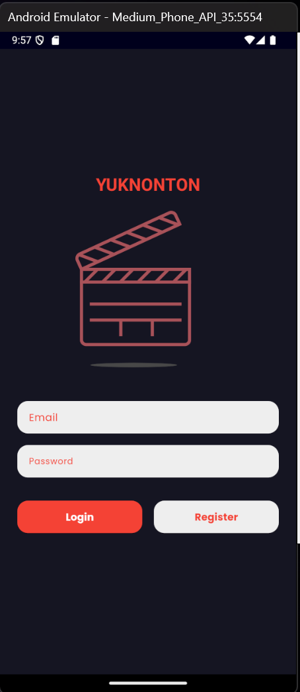
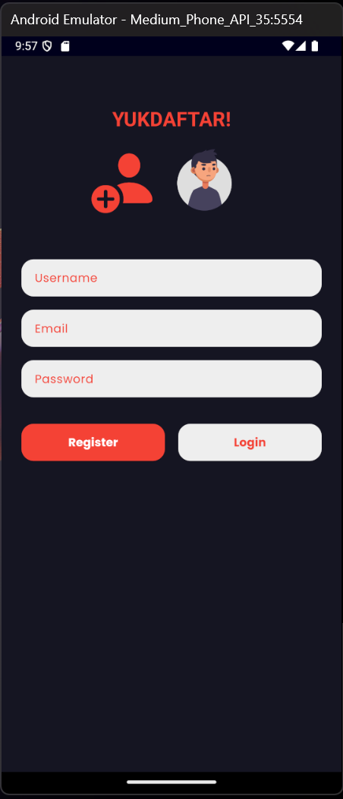
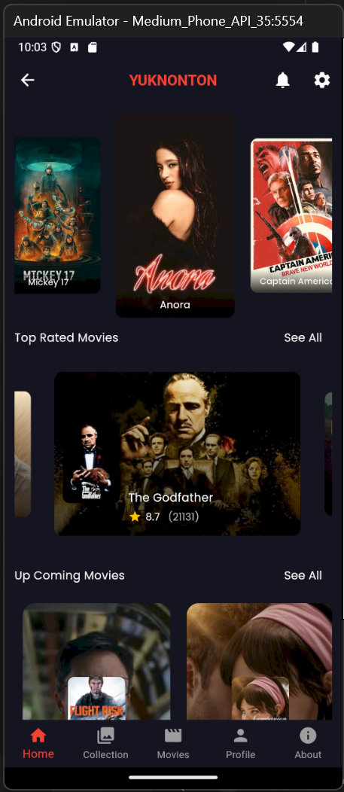
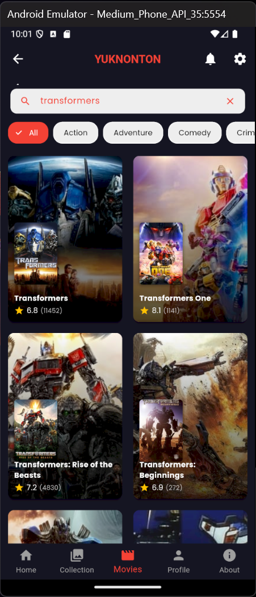
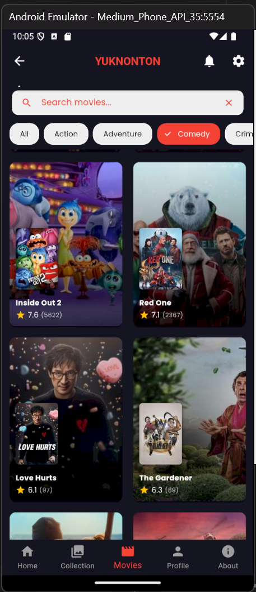
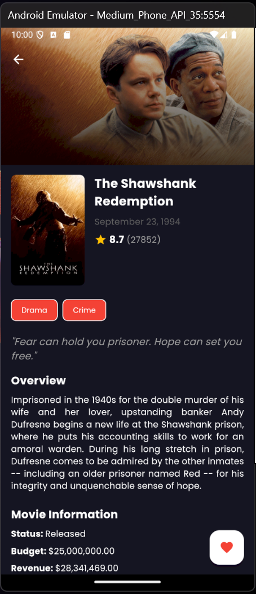
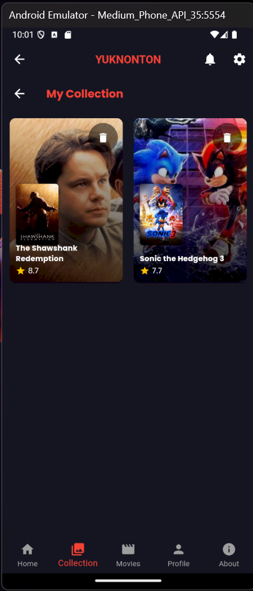
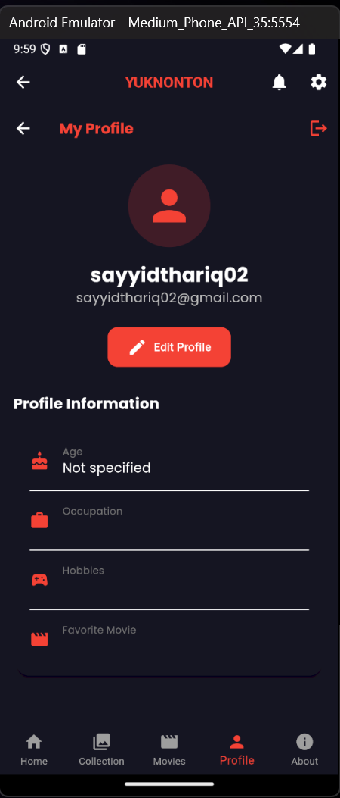
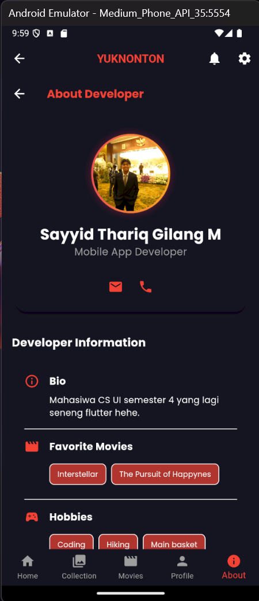
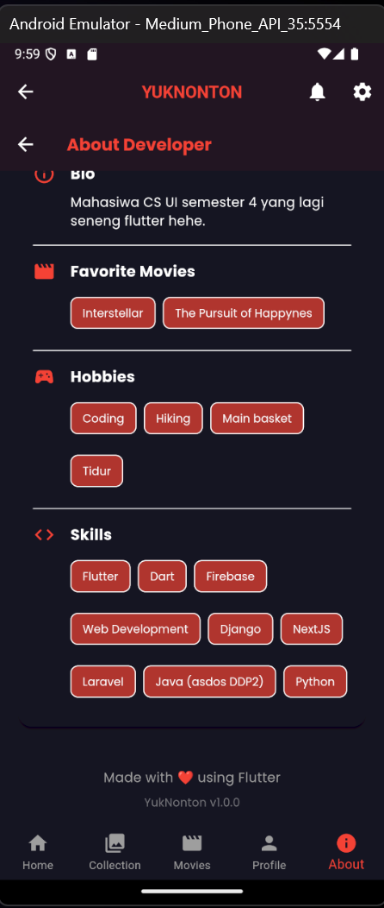

# YUKNONTON

Sebuah project flutter yang menampilkan daftar film dari API The Movie Database (TMDb). Project ini dibuat untuk memmpelajari akses api serta clean architecture dalam flutter. Penggunaan firebase auth juga digunakan untuk login dan register. Serta edit profile.

## Features

### 1. Authentication
| Login | Registration |
|:-----:|:------------:|
|  |  |

### 2. Movie Browsing
View trending, top-rated, upcoming, and popular movies in home screen

  

### 3. Search Functionality
Search movies by title or filter by genre

   
  

### 4. Movie Details
View comprehensive movie information including title, poster, backdrop, release date, rating, overview, genres, and cast

  

### 5. Personal Collection
Add and manage your favorite movies

  

### 6. User Profile Management
| Edit Profile | Developer Info |
|:------------:|:-------------:|
|  |   |

### 7. Additional Features
- Logout functionality
- Responsive UI design
- Movie recommendations

## Location
semua file yang berhubungan dengan project ini berada di folder `movies` , saya juga sedah menerapkan pembagian foldernya sedemikian rupa seperti:
- `lib` : berisi file dart yang berhubungan dengan aplikasi
- `models` : berisi file dart yang berhubungan dengan model data
- `services` : berisi file dart yang berhubungan dengan service
- `assets` : berisi file gambar yang digunakan dalam aplikasi
- `screens` : berisi file dart yang berhubungan dengan tampilan aplikasi
- `widgets` : berisi file dart yang berhubungan dengan widget yang digunakan dalam aplikasi

## Plugins
- `firebase_auth` : digunakan untuk autentikasi user
- `firebase_core` : digunakan untuk menghubungkan aplikasi dengan firebase
- `cloud_firestore` : digunakan untuk menyimpan data user
- `http` : digunakan untuk melakukan request ke API
- `lotte` : digunakan untuk menampilkan animasi
- `intl` : digunakan untuk mengubah format tanggal
- `cached_network_image` : digunakan untuk menampilkan gambar dari url
- `tmdb_api` : digunakan untuk mengakses API TMDB

## Lesson Learned

Proyek YUKNONTON adalah aplikasi mobile yang memanfaatkan API TMDB dan Firebase. Aplikasi ini memungkinkan pengguna untuk registrasi akun menggunakan email, login ke dalam aplikasi, melihat daftar film yang sedang trending, top-rated, upcoming, serta popular movies, mencari film, melihat detail setiap film, memperbarui profil (menambahkan hobi, pekerjaan, dan film favorit), serta menambahkan film ke dalam koleksi pribadi.

Dari proyek ini, saya mempelajari beberapa hal penting:

1. Pemanfaatan Plugin di Flutter
Flutter adalah framework yang powerful, multiplatform, dan kompatibel, mirip dengan React menurut saya. Salah satu keunggulannya adalah banyaknya plugin siap pakai yang mempermudah pengembangan, seperti Firebase Authentication untuk login, Cloud Firestore untuk penyimpanan data pengguna, serta berbagai plugin lain yang mempercepat integrasi fitur. Dokumentasi yang tersedia juga sangat lengkap dan membantu.

2. Penerapan Best Practices dalam Flutter
Saya belajar pentingnya menerapkan Clean Architecture, prinsip SOLID, dan penggunaan model yang benar dalam Flutter. Dengan struktur kode yang rapi, pengembangan dan pemeliharaan aplikasi menjadi lebih efisien.

3. Pentingnya Mencari Referensi
Dokumentasi resmi Flutter, API, plugin, serta berbagai tutorial di internet sangat membantu dalam menyelesaikan tantangan teknis. Kunci utamanya adalah memiliki inisiatif dan niat untuk mengeksplorasi sumber daya yang tersedia.

4. Menggunakan API Eksternal dengan Baik
Sebelumnya, saya pernah menggunakan API dari Django, tetapi kali ini saya harus beradaptasi dengan API eksternal (TMDB). Untuk memastikan data sesuai, saya menggunakan Postman untuk menguji dan memahami struktur API sebelum mengimplementasikannya.

Secara keseluruhan, proyek ini merupakan pengalaman yang sangat menyenangkan dan memberikan banyak wawasan baru dalam pengembangan aplikasi mobile dengan Flutter. 
